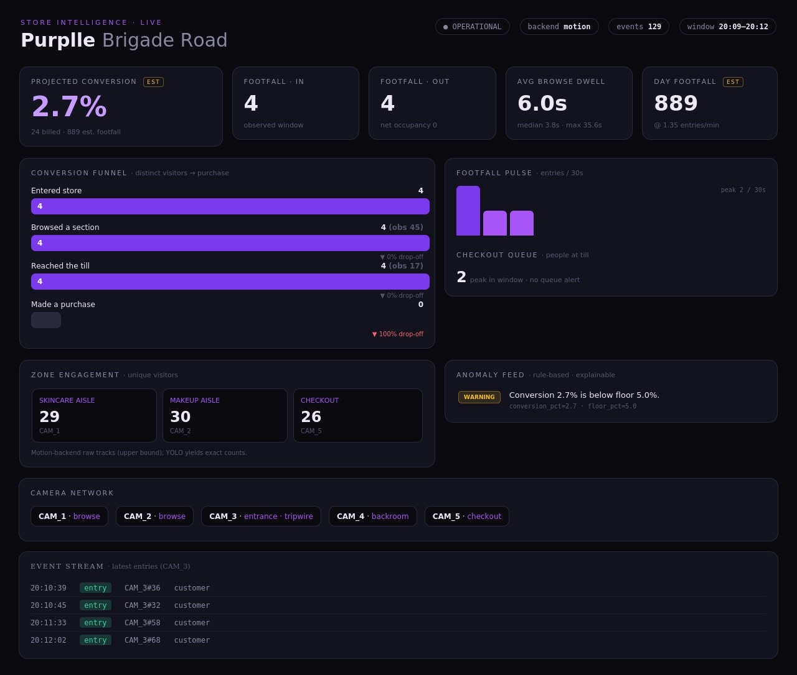

# Store Intelligence System

Turn raw store CCTV into business intelligence — **footfall, conversion funnel,
dwell/engagement, and anomalies** — served via a JSON API and a live dashboard.

Built for **Purplle, Brigade Road, Bangalore** (`ST1008`) from 5 camera feeds +
the day's POS export + the floor plan.

> Headline on the supplied footage: **4 in / 4 out** at the door over a ~3-min
> window, ~**1.7 entries/min**, ~**1,100** projected day footfall, **24** billed
> invoices → ~**2.2%** projected day conversion (flagged as an estimate).



📊 **[Pitch deck (PPTX)](assets/Store_Intelligence_Pitch.pptx)** · 🏗 **[Architecture diagram](assets/snapshot_2_architecture.jpg)**

---

## Quickstart — Docker (acceptance-gate path)

```bash
docker compose up --build
# → API + dashboard on http://localhost:8000
```

The image ships a **pre-computed `data/events.db`** built from the real clips, so
the API serves real data immediately — no footage or GPU required.

```bash
curl localhost:8000/health
curl localhost:8000/metrics
curl localhost:8000/funnel
open http://localhost:8000/        # the dashboard
```

### Run it on your own footage
Drop `CAM_1.mp4 … CAM_5.mp4` into `./videos/`, then:

```bash
FORCE_INGEST=1 docker compose up --build     # re-ingests on startup
```

## Quickstart — local (no Docker)

```bash
make install                                  # base deps (motion backend)
# put CAM_*.mp4 in ./videos  (or point --videos at them)
python scripts/ingest.py --videos /path/to/videos --db ./data/events.db
make serve                                    # http://localhost:8000
make test                                     # 26 tests
```

Enable the production YOLOv8 backend:

```bash
make install-yolo
python scripts/ingest.py --videos ./videos --backend yolo
```

## Endpoints

| Endpoint        | What you get                                             |
|-----------------|----------------------------------------------------------|
| `GET /health`   | status, event count, detector backend, last ingest       |
| `GET /metrics`  | footfall, engagement, dwell, revenue, day projection, TS  |
| `GET /funnel`   | entered → engaged → reached_till → purchased + drop-off   |
| `GET /events`   | raw structured events (`?event_type=&camera_id=&limit=`)  |
| `GET /anomalies`| rule-based alerts with severity + evidence                |
| `GET /cameras`  | camera roster, zones, presence heatmaps                   |
| `GET /`         | live dashboard                                            |

Scope any analytics call to a window: `GET /funnel?start=2026-04-10T19:50:00&end=2026-04-10T20:30:00`.

## Project layout

```
config/store_config.yaml      cameras, zones, tripwire, hours, thresholds (no code)
src/store_intel/
  schema.py                   the unified Event
  config.py                   typed YAML loader
  detectors/                  yolo | motion + factory  (Detector interface)
  tracking/centroid_tracker   SORT-lite
  pipeline/                   tripwire, zones, camera_worker, runner
  fusion/                     pos (CSV→invoices), sessions (funnel)
  analytics/                  metrics, anomaly
  store/db.py                 SQLite event log + heatmaps + run provenance
  api/                        FastAPI app + dashboard.html
scripts/ingest.py             footage → events.db (CLI)
tests/                        26 pytest tests (no video required)
docker/                       entrypoint
DESIGN.md  CHOICES.md         architecture & decisions
```

## How it works (one paragraph)

Each camera is processed at a throttled 5 fps: a detector finds people, a tracker
gives them anonymous IDs, and role-specific logic turns motion into **events** —
a directional **tripwire** on the door produces `entry`/`exit`; **polygon zones**
on the aisles and till produce `presence` events with dwell. Events land in
SQLite. The **fusion** layer joins them with POS invoices into a conversion
funnel, **analytics** compute the KPIs and run explainable **anomaly** rules, and
the **API**/dashboard serve it all live. Swapping detector backends, stores, or
storage engines is a config/interface change — the event contract stays fixed.

## Notes on integrity & privacy

- Numbers are computed from the footage, not hardcoded: re-ingesting different
  footage, or querying a different `?start/end` window, changes every output.
  `/health` records the backend and ingest time as provenance.
- Tracking is **anonymous** — ephemeral per-camera IDs, **no face recognition**,
  no cross-camera identity. See `CHOICES.md`.
